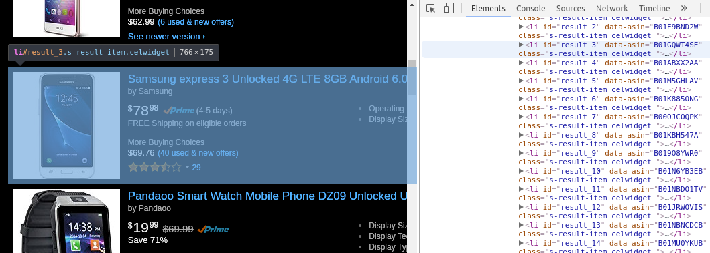

# SCRAPING NA AMAZON COM SCRAPY E POSTGRESQL
## Código e pensamentos
#### Autor: Giulio Carvalho (github.com/giuliocc)
---
### Salve, salve, nobre engenheiro!
                                
### Este repo irá tratar sobre como fazer o scraping de unlocked cellphones (celulares desbloqueados) na Amazon.com utilizando Scrapy e PostgreSQL
---

#### Começando (ainda não) do começo:

A Amazon tem uma política anti-scraping. Neste projeto seremos legais e traremos o mínimo de congestionamento para os servidores deles e usaremos os dados apenas para motivos de aprendizado. Por fim, torceremos para que não me processem :D

Antes de tudo, devemos esclarecer a ideia de modo geral:

- Iremos fazer o scraping de todos os celulares da seção de celulares desbloqueados
- Dados que queremos: 
    - ASIN (identificador de produto da Amazon)
    - Marca
    - Preço Amazon
    - Preço dos parceiros da Amazon
    - Número de avaliações
    - Média de avaliações (estrelas)
    - Porcentagem de cada nível de avaliação (1-5 estrelas) do total
- Iremos utilizar Scrapy para fazer o scraping e PostgreSQL para guardar os dados que obtivermos

#### Começando (agora sim) do começo:

- Você deve configurar o PostgreSQL (eu utilizei a versão 9.3.15)
- Eu utilizei um gerenciador de ambiente (Anaconda 4.3.14) para este projeto
- Crie o ambiente com Python 3 (eu utilizei 3.6.1)
- Instale o Scrapy (utilizei a versão 1.3.3) e suas dependências
- Instale o Psycopg2 (utilizei a versão 2.7.1) e suas dependências
- (Opcional) Instale o Jupyter (utilizei a versão 4.3.0) e suas dependências [irá tornar a experiência com o scrapy shell mais amigável]
- Dê um `git clone https://github.com/giuliocc/amazonScrapy.git`
- Crie uma tabela de nome *phoneData* no postgres (comando em /amazon_u_cellphones/pipelines.py)
- Configure a linha `self.connection = psycopg2.connect(host='localhost', database='teste', user='ubuntu', password='123456')` em /amazon_u_cellphones/pipelines.py para suas configurações de banco de dados
- Se desejar rodar o programa, execute `scrapy crawl phones` 


Não irei demonstrar nenhuma utilização do `scrapy shell`, mas é altamente recomendável que o utilize para testes e debugs ao invés do `scrapy crawl`.

#### /amazon_u_cellphones/items.py
Aqui apenas definiremos os campos do item que queremos coletar e enviar pro banco, neste caso, um celular.

Cada campo do item é atribuído com `scrapy.Field()`.
```python
import scrapy

class AmazonUCellphonesItem(scrapy.Item):
    # define the fields for your item here like:
    # name = scrapy.Field()
    
    #amazon product identifier
    asin = scrapy.Field()
    
    #product brand
    brand = scrapy.Field()
    
    #product amazon price
    priceAmz = scrapy.Field()
    
    #product other stores (amazon partners) price
    priceOthers = scrapy.Field()
    
    #product number of reviews
    reviewCount = scrapy.Field()
    
    #product review stars mean
    starMean = scrapy.Field()
    
    #product 1-star reviews percentage
    star1 = scrapy.Field()
    
    #product 2-star reviews percentage
    star2 = scrapy.Field()
    
    #product 3-star reviews percentage
    star3 = scrapy.Field()
    
    #product 4-star reviews percentage
    star4 = scrapy.Field()
    
    #product 5-star reviews percentage
    star5 = scrapy.Field()
    
    pass
```

#### /amazon_u_cellphones/spiders/phone_spider.py
Iremos precisar de alguns módulos além do scrapy:

- urllib: manipução de urls
- logging: manipulação de logs
- configure_logging: desativar o root handler
- items*: /amazon_u_cellphones/items.py para criação e manipulação dos itens
```python
import scrapy
import urllib
import logging
from scrapy.utils.log import configure_logging

from amazon_u_cellphones.items import *
```
Daremos o nome da nossa spider e estabeleceremos um limite de domínios permitidos.
```python
class PhoneSpider(scrapy.Spider):
    #setup spider name and domain
    name = "phones"
    allowed_domains = [ "amazon.com" ]
```
Configuraremos nosso log para que ele seja adicionado ao arquivo scrape.log. Também configuraremos o formato e o nível de log dos loggers. Manteremos o nível de log no nível `INFO`, para que mensagens de todos níveis de log sejam guardadas no arquivo.
```python
	#configure logging to scrape.log
    configure_logging(install_root_handler=False)
    logging.basicConfig(
        filename='scrape.log',
        format='%(asctime)s %(levelname)s: %(message)s',
        datefmt='%d/%m/%Y %H:%M:%S',
        level=logging.INFO
    )
```
Agora iremos procurar a nossa url inicial.

Vamos mexer um pouco, ir nas seções de telefonia.

Vamos encontrar a seção *Any Category>Cell Phones & Accessories>Cell 
Phones>Unlocked Cell Phones*.

Vamos fazer uma pesquisa por *unlocked cellphones* na seção.

A ideia é ir mexendo na url até encontrar uma url que contenha todos os resultados (note que normalmente só retornam 13 páginas).

Por fim, encontraremos a seguinte url: `https://www.amazon.com/unlocked-cell-phones/s?ie=UTF8&page=1&rh=n%3A2407749011%2Ck%3Aunlocked%20cell%20phones`

Ela demonstra que estamos na seção certa, e ela possui uma busca por query string. Sua querystring possui o enconding, a página que estamos e os termos de busca.

Assim vamos passar essa url como sendo nossa url inicial.

Faremos uma manipulação na query string utilizando um dicionário e passando-o para `urlencode()`.
```python
	#url info
    base_url = "https://www.amazon.com/unlocked-cell-phones/s?"
    querystring = {
        'ie': 'UTF8',
        'page': 1,
        'rh': 'n%3A2407749011%2Ck%3Aunlocked%20cell%20phones'
    }
    
    #start from this url
    #urlencode encodes '%' from querystring['rh'] as %25, so i had to do this little workaround to get it back
    start_urls = [ base_url + urllib.parse.urlencode(querystring).replace('%25', '%') ]
```
Nessa página inicial de cara vemos que existem produtos que não são celulares na lista, como esse smartwatch.


Não queremos que esses itens sejam adicionados ao nosso banco de dados. Então, criaremos uma `blacklist` e a preencheremos com alguns termos relevantes.
```python
    #don't scrape products where titles contains these keywords
    blacklist = {'watch', 'case', 'pendant', 'adapter', 'headset', 'tracker'}
```
Pronto! A inicialização está completa.

Agora vamos fazer o parsing dessa página.

##### Antes, um disclaimer: vamos começar a trabalhar com XPath, talvez eu possa não ter utilizado o XPath da maneira mais rápida e em alguns caso mais legível de se trabalhar. Não copiei nenhum XPath diretamente do HTML da página no inspetor de elementos, mas sim fui procurando padrões e fazendo a busca XPath de acordo com eles. Fiz isso por motivos de aprendizado e não produtividade.

Vemos na página que cada resultado é um elemento `li` com `@id=result_[id do resultado]`.



Já que vamos trabalhar apenas dentro desta lista, vamos gerar uma lista de seletores onde cada elemento é um seletor de um resultado.

```python
	#default parser, parses phone list page
    def parse(self, response):
        
        #list of result selectors
        resultList = response.xpath('//li[contains(@id, "result_")]')
```
Vamos iterar sobre essa lista.

Procurando padrões do mesmo jeito para encontrar o XPath, iremos extrair o título do produto. Iremos utilizar esse título para verificar se algum termo contido na blacklist existe dentro no título e só iremos criar o item para ser armazenado caso não esteja contido.

```python
        for result in resultList:
            #product title
            title = result.xpath('.//h2[contains(@class, "s-access-title")]/text()').extract_first().lower()
            #if title doesn't contain any keyword from blacklist, proceed
            if(not(any(x in title for x in iter(self.blacklist)))):
                
                #create item
                item = AmazonUCellphonesItem()
```
Seguindo o mesmo modo de busca por XPaths, iremos extrair todas as informações (exceto avaliações, por enquanto) pro nosso item.
```python
                #get asin
                asin = result.xpath('@data-asin').extract_first()
                #as design choice: if not found, use None (which will be converted to NULL in postgres)
                item['asin'] = asin
                
                #get brand
                brand = result.xpath('.//span/text()[contains(., "by")]/../following-sibling::*[1]/text()').extract_first()
                if(brand):
                    #make it lowercase for database-consistence
                    brand = brand.lower()
                #as design choice: if not found, use None (which will be converted to NULL in postgres)
                item['brand'] = brand
                
                #get priceOthers
                priceOthers = result.xpath('.//span[contains(@class, "a-size-base a-color-base")]/text()').extract()
                priceOthers = findPriceInList(priceOthers)
                #as design choice: if not found, use None (which will be converted to NULL in postgres)
                item['priceOthers'] = priceOthers
                
                #get priceAmz
                priceAmz = result.xpath('.//span[contains(@class, "sx-price sx-price-large")]/parent::*/@aria-label').extract()
                priceAmz = findPriceInList(priceAmz)
                #as design choice: if not found, use None (which will be converted to NULL in postgres)
                item['priceAmz'] = priceAmz
                
                #get reviewCount
                reviewCount = result.xpath('.//span[@name="'+asin+'"]/following-sibling::*[1]/text()').extract_first()
                if(reviewCount):
                    #remove commas from number
                    reviewCount = int(reviewCount.replace(',', ''))
                    item['reviewCount'] = reviewCount
                else:
                    #as design choice: if not found, use 0
                    item['reviewCount'] = 0
```
Como pode ser notado, para encontrar os preços do produto, necessitamos da função `findPriceInList()`. 

Ela irá procurar o último elemento de uma lista e procurará o caractere "$" (este é um padrão que pode ser observado para encontrar os preços). Caso encontre, retorna o preço.

Então, definiremos ela na nossa `parse()`.
```python
            #if list contains price, return it as a float. if not, return None
            def findPriceInList(l):
                if(l):
                    #price as the list's last item is a common pattern
                    if (l[-1][0] == '$'):
                        #remove '$' and ',' and return it as a float 
                        return float(l[-1][1:].replace(',', ''))
                    else:
                        return None
                else:
                    return None
```
Mas ainda faltam os campos `starMean`, `star1`, `star2`, `star3`, `star4` e `star5`.

Primeiro, iremos procurar o campo `starMean` e, caso ele exista, iremos procurar os outros campos dentro da página do produto.
```python
                starMean = result.xpath('.//span/text()[contains(., "out of 5 stars")]').extract_first()
                if(starMean):
                    #get string content except ' out of 5 stars' (which contains 15 characters) and convert it to float
                    starMean = float(starMean[:-15])
                    item['starMean'] = starMean
                    
                    #get phone product page url
                    phoneUrl = result.xpath('.//a[contains(@class, s-access-detail-page)]/@href').extract_first()
                    
                    #create request
                    request = scrapy.Request(phoneUrl, callback=self.parsePhone, errback=self.errback)
                    
                    #pass item as argument to parsePhone()
                    request.meta['item'] = item
                    
                    #make request and yield the return from parsePhone() (which will be the item)
                    yield request
                else:
                    #as design choice: if not found, use None (which will be converted to NULL in postgres)
                    item['starMean'] = None
                    item['star1'] = None
                    item['star2'] = None
                    item['star3'] = None
                    item['star4'] = None
                    item['star5'] = None
                    #as a request to the phone page will not be made, yield item
                    yield item
```
A função `parsePhone()` irá procurar a pelas barras do histograma de avaliações no fim da página do produto, extrair a porcentagem de cada uma e retornar o item com todos os campos preenchidos.
```python
    #secondary parser, parses phone product page
    def parsePhone(self, response):
        #get item passed from parse()
        item = response.meta['item']
        
        #list of reviews' histogram rows selectors
        histRows = response.xpath('//tr[contains(@class, "a-histogram-row")]')
        
        #iterate over histRows in a reverse order (1-5, normally 5-1) and enumerated starting from 1
        for i, row in enumerate(reversed(histRows), 1):
            # get ith-star percentage
            pctg = row.xpath('.//a[contains(@class, "histogram-review-count")]/text()').extract_first()
            if(pctg):
                #ith star receives percentage converted to int except '%' character
                item['star'+str(i)] = int(pctg[:-1])
            else:
                #as design choice: if not found, use 0
                item['star'+str(i)] = 0
        
        #return item to be yielded
        return item
```
A função `errback()` irá reportar o erro, em caso de alguma requisição falhar.
```python
    def errback(self, failure):
        # log all failures
        self.logger.error(repr(failure))
```
Depois que a iteração sobre a lista de resultados terminar, passar para a próxima página.

Para isso, veremos se o botão de "Next Page" está na página. Caso esteja, incrementaremos o valor de `querystring['page']` em 1 e requisitaremos a próxima página. Caso contrário, daremos nosso trabalho por encerado e pode correr pro abraço.
```python
        #if there is a next page, parse next page
        if(response.xpath('//a[@id="pagnNextLink"]')):
            self.querystring['page'] += 1
            yield scrapy.Request(url=self.base_url + urllib.parse.urlencode(self.querystring).replace('%25', '%'), callback=self.parse, errback=self.errback)
        
        return
```
Mas calma que tem mais, precisamos definir o nosso `pipeline` e nossas `settings`.

**Pipeline**:
Processo que irá inserir nosso item no banco de dados.

**Settings**:
Configurações gerais do nosso crawler.

#### /amazon_u_cellphones/pipelines.py
Aqui precisamos importar alguns módulos:

- psycopg2: Interagir com o banco PostgreSQL
- datetime: obter instante de tempo atual

```python
import psycopg2
from datetime import datetime
```
Aqui definiremos nossa classe de pipeline e configuraremos sua `__init__()`.

Na `__init__()`, configuraremos os parâmetros de conexão com o banco (estes foram os que usei, configure os seus) e criaremos o cursor para interagir com ele.
```python
class AmazonUCellphonesPipeline(object):
    def __init__(self):
        #connect to database
        self.connection = psycopg2.connect(host='localhost', database='teste', user='ubuntu', password='123456')
        
        #set cursor
        self.cursor = self.connection.cursor()
```
Aqui deixei o comando de criação da tabela para que suas colunas tenham os devidos tipos (todas as colunas são do item, exceto a `id` e `createdAt`, que são um id que servirá de chave primária e uma data de criação no momento de inserção da linha na tabela, respectivamente).

Também faremos o comando de inserir linha na tabela e dar um `commit()` nas modificações. 
```python
    def process_item(self, item, spider):
        
        '''
        Table creating command:
            CREATE TABLE phoneData (id serial PRIMARY KEY, asin varchar, brand varchar, priceAmz float, priceOthers float, reviewCount integer, starMean float, star1 integer, star2 integer, star3 integer, star4 integer, star5 integer, createdAt varchar);
        '''
        
        #add item to table
        self.cursor.execute("INSERT INTO phoneData ( asin, brand, priceAmz, priceOthers, reviewCount, starMean, star1, star2, star3, star4, star5, createdAt ) VALUES (%s, %s, %s, %s, %s, %s, %s, %s, %s, %s, %s, %s);", [
                item['asin'],
                item['brand'],
                item['priceAmz'],
                item['priceOthers'],
                item['reviewCount'],
                item['starMean'],
                item['star1'],
                item['star2'],
                item['star3'],
                item['star4'],
                item['star5'],
                str(datetime.now())])
        
        #commit changes
        self.connection.commit()
        
        return item
```

#### /amazon_u_cellphones/settings.py
Aqui configuraremos a linha `DOWNLOAD_DELAY = 3` para que o crawler espere pelo menos três segundos antes fazer uma nova requisição. Isso evitará congestionamento no servidor e que nosso robô seja facilmente detectado e o scraping pare.
```python
# Configure a delay for requests for the same website (default: 0)
# See http://scrapy.readthedocs.org/en/latest/topics/settings.html#download-delay
# See also autothrottle settings and docs
DOWNLOAD_DELAY = 3
# The download delay setting will honor only one of:
#CONCURRENT_REQUESTS_PER_DOMAIN = 16
#CONCURRENT_REQUESTS_PER_IP = 16
```
Aqui configuraremos o pipeline que usaremos.
```python
# Configure item pipelines
# See http://scrapy.readthedocs.org/en/latest/topics/item-pipeline.html
ITEM_PIPELINES = {
    'amazon_u_cellphones.pipelines.AmazonUCellphonesPipeline': 300,
}
```
Aqui será utilizada a extensão AutoThrottle, que irá adicionar mais algum atraso acima do nosso `DOWNLOAD_DELAY` baseado no tempo de resposta das requisições anteriores. Assim, evitando mais ainda o risco de congestionamento e de fácil de detecção.
```python
# Enable and configure the AutoThrottle extension (disabled by default)
# See http://doc.scrapy.org/en/latest/topics/autothrottle.html
AUTOTHROTTLE_ENABLED = True
# The initial download delay
AUTOTHROTTLE_START_DELAY = 5
# The maximum download delay to be set in case of high latencies
AUTOTHROTTLE_MAX_DELAY = 60
# The average number of requests Scrapy should be sending in parallel to
# each remote server
AUTOTHROTTLE_TARGET_CONCURRENCY = 1.0
# Enable showing throttling stats for every response received:
#AUTOTHROTTLE_DEBUG = False
```

---
Se desejar rodar o programa, execute `scrapy crawl phones` e veja o resultado!

---
### Por enquanto, isso é tudo, pessoal!  Abraço!

---
Este código-fonte está sob a MIT License, veja License.txt para mais detalhes.